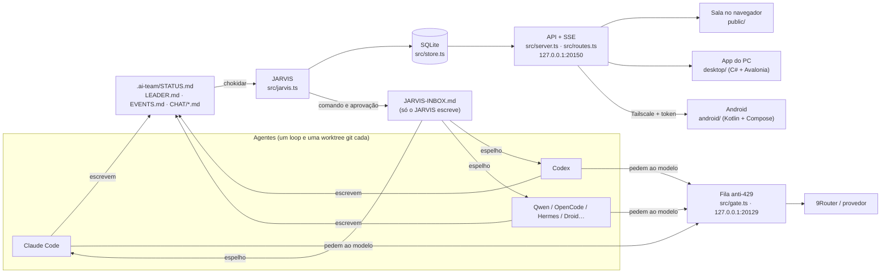

# Arquitetura

O Agent Control não conversa com os agentes por API. Os agentes escrevem Markdown nas próprias pastas, e o servidor
lê esses arquivos, guarda no SQLite e mostra nas telas. As ordens do dono voltam pelo mesmo caminho: um arquivo que
só o servidor escreve.

## Caminho de uma ordem

1. O dono manda "faça deploy" pela sala, pelo PC ou pelo celular → `POST /api/commands`.
2. `src/commands.ts` decide se é ação protegida (`requiresApproval`), grava no banco com o código `J-001` e quem pediu,
   e acrescenta a entrada no `JARVIS-INBOX.md` do Goal ativo, espelhado em cada worktree.
3. O líder (ou o agente de destino) lê o inbox, responde `- jarvis: J-001` / `- status: ACK` no próprio STATUS.
4. O watcher vê a mudança, `trackCommands` atualiza o status. Se um comando protegido "andar" sem aprovação, vira
   `VIOLATION`.
5. Aprovar (`POST /api/commands/decide`) acrescenta `approved: J-001` no inbox. Com a aprovação em dupla, isso só
   acontece no segundo "sim" de outra pessoa.

Tudo que muda o time ou a segurança entra na auditoria (`Store.audit`): cada linha guarda o hash da anterior, e o
banco recusa `UPDATE`/`DELETE` nela.

## Peças do servidor (`src/`)

| Arquivo | O que faz |
|---|---|
| `main.ts` | Liga tudo: lê `jarvis.config.json`, sobe o JARVIS, o servidor local e (se ligado) o remoto. |
| `jarvis.ts` | Vigia os arquivos, ingere entradas novas, emite eventos (`entries`, `commands`, `chat`, `panic`…). |
| `server.ts` | Autenticação (local, Bearer, sessão por cookie), `Host`/`Origin`, CSRF, pânico, arquivos estáticos. |
| `routes.ts` | **Todas as rotas da API em tabela**, com o papel mínimo de cada uma. Rota nova entra aqui. |
| `store.ts` | SQLite: entradas, comandos, votos, auditoria, ajustes. Migrações numeradas (`PRAGMA user_version`). |
| `commands.ts` | Detecção de ação protegida, inbox, aprovação (simples e em dupla), guarda contra inbox forjado. |
| `sources.ts`, `parser.ts` | Onde ficam os arquivos dos agentes e como ler os blocos `## data — AGENTE`. |
| `chat.ts`, `reply.ts` | Sala central: cada pessoa/agente escreve no próprio arquivo; o AgentC responde o dono. |
| `call.ts` | Chamada por voz com os agentes (turnos, anexos, ata no vault). |
| `team.ts`, `sessions.ts` | Modo Time (papéis dono/membro/leitura, convites por token) e sessões do navegador. |
| `plans.ts` | Planos e licença assinada (Ed25519, conferida offline). |
| `redact.ts`, `normalize.ts` | Filtro de segredos e limpeza de texto antes de gravar, mostrar ou mandar a um modelo. |
| `gate.ts`, `usage.ts` | Fila anti-429 na frente do provedor e o uso por agente. |

## Papéis

`leitura` < `membro` < `dono`. Cada rota em `routes.ts` declara o mínimo. Toda escrita pede pelo menos `membro`;
aprovar, mexer no time, nos agentes, na licença e no pânico é `dono`. O teste `test/v4.test.ts` passa por todas as
rotas com cada papel; uma rota nova sem papel certo quebra o CI.

## Versão

`version.json` é a fonte única. `node tools/versao.mjs` copia para `package.json`, `.csproj` e o `predio.js` do site;
o Android lê o arquivo no build.
