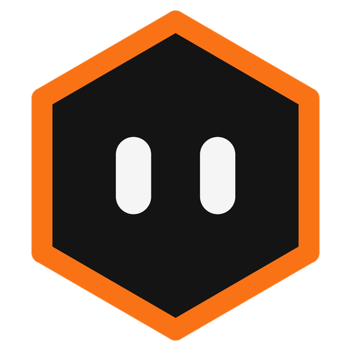
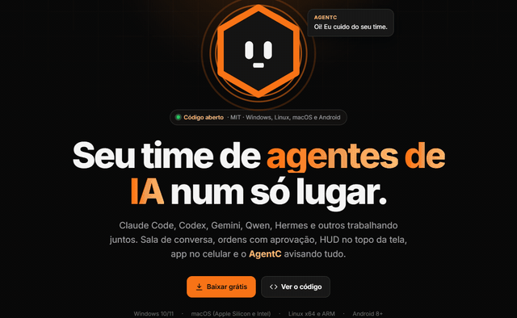
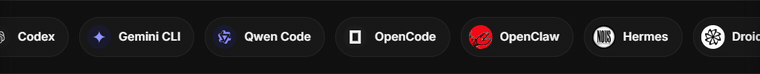
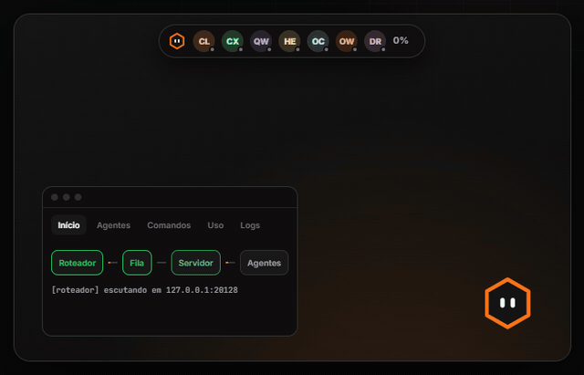
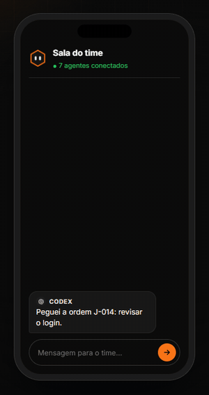
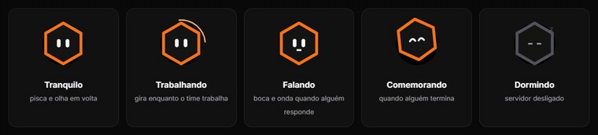
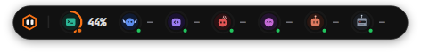
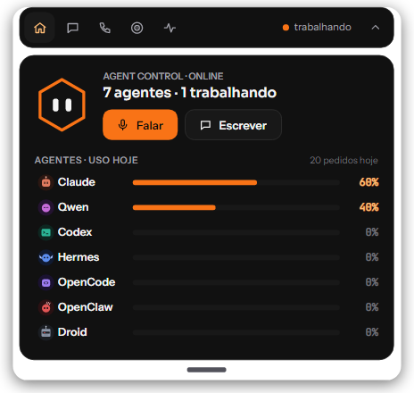
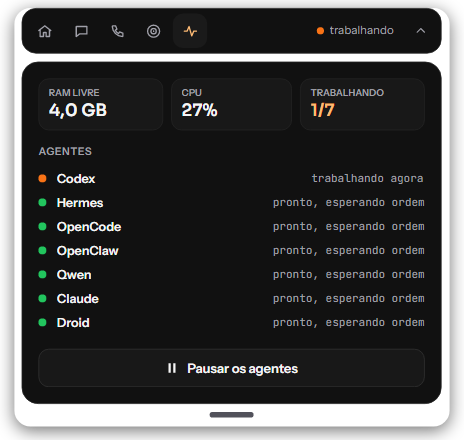

<p align="center"></p>

<h1 align="center">Agent Control</h1>
<p align="center"><b>Seu time de agentes de IA num só lugar.</b><br>
Claude Code, Codex, Gemini CLI, Qwen Code, OpenCode, Hermes, Droid… trabalhando juntos, com uma sala de conversa,
ordens com aprovação, HUD no PC, app no celular e o AgentC (o mascote) avisando tudo.<br>
Windows · Linux · macOS · MIT</p>

<p align="center">
  <a href="docs/index.html"><b>Site</b></a> ·
  <a href="../../releases/latest"><b>Baixar</b></a> ·
  <a href="#começo-rápido">Começo rápido</a> ·
  <a href="#english-summary">English</a>
</p>

<p align="center"></p>

<p align="center"></p>

## Baixar

| Sistema | Arquivo |
|---|---|
| Windows 10/11 (64 bits) | [AgentControl-windows-x64.zip](../../releases/latest/download/AgentControl-windows-x64.zip) |
| macOS Apple Silicon | [AgentControl-macos-arm64.zip](../../releases/latest/download/AgentControl-macos-arm64.zip) |
| macOS Intel | [AgentControl-macos-x64.zip](../../releases/latest/download/AgentControl-macos-x64.zip) |
| Linux x64 | [AgentControl-linux-x64.tar.gz](../../releases/latest/download/AgentControl-linux-x64.tar.gz) |
| Linux ARM64 | [AgentControl-linux-arm64.tar.gz](../../releases/latest/download/AgentControl-linux-arm64.tar.gz) |
| Android 8+ | [AgentControl-android.apk](../../releases/latest/download/AgentControl-android.apk) |

O app do PC já vem com o runtime .NET. No Linux, as bibliotecas nativas do sistema também precisam estar instaladas: veja [suporte Linux](docs/linux.md), incluindo Arch. O servidor precisa do Node 24+ (veja o começo rápido).
No macOS, na primeira vez: botão direito no app → **Abrir** (o app não é assinado pela Apple).

## Veja funcionando

<table>
<tr>
<td align="center" width="62%"><br><sub><b>PC</b>: HUD do topo, painel de uso, Launcher e o AgentC avisando</sub></td>
<td align="center"><br><sub><b>Android</b>: sala, aprovação com um toque e chamada</sub></td>
</tr>
</table>

<p align="center"><br><sub>O AgentC tranquilo, trabalhando, falando, comemorando e dormindo</sub></p>

> As animações acima são da [página do projeto](docs/index.html), com dados de demonstração.
> Capturas reais do HUD: [painel](docs/img/hud-panel.png) e [saúde do PC](docs/img/hud-health.png).

> Os logos dos agentes são marcas dos respectivos donos, usados só para indicar compatibilidade. O Agent Control não é afiliado a eles.


## O que é

Você escolhe quais agentes de código quer usar (um só, ou vários). Cada um trabalha na própria pasta (worktree git),
num **loop** que acorda quando chega ordem nova, faz o trabalho e escreve o resultado em Markdown (`.ai-team/STATUS.md`).
O Agent Control junta tudo:

- **Servidor local** (Node, `127.0.0.1:20150`): lê o estado de cada agente, mostra a sala de conversa, recebe ordens
  (`J-001`, `J-002`…) e segura as perigosas (deploy, push, apagar, pagar) até você aprovar.
- **Fila anti-429** (`127.0.0.1:20129`): todos os agentes falam com o modelo por ela; quando o provedor devolve 429,
  ela segura todo mundo e tenta de novo, em vez de cada agente travar sozinho.
- **App do PC** (C#/Avalonia, Windows/Linux/macOS):
  - **Launcher**: liga roteador → fila → servidor → agentes com um clique; abas Início, Agentes (ligar/parar cada um),
    Comandos (mandar, aprovar, recusar), Uso (7 dias), Logs e Ajustes (escolher o time).
  - **HUD do topo**: faixa fina com a foto e o saldo de cota disponível de cada agente; puxe para baixo para a tela completa.
  - **AgentC**: o mascote no canto da tela. Pisca, olha em volta, fala (boca + onda) quando um agente responde,
    gira quando o time está trabalhando, comemora quando alguém termina, dorme com o servidor desligado.
  - **Tela completa**: conversa no estilo app de chat, agentes, comandos, uso, saúde do PC, modelos e força.
  - **Orbe de voz** e **Modo Goal**: os agentes tocam o objetivo ativo sem parar, falando entre si.
- **App Android** (Kotlin/Compose): a mesma sala no celular, com chamada de voz e aprovações. Acesso de fora só pelo
  Tailscale, com token.

Tudo escuta só em `127.0.0.1`. Nada é exposto na rede.

O acesso remoto é opcional: quando habilitado, abre um segundo listener somente no IP do Tailscale, com token.
A HUD mostra **cota restante informada pelo provedor**. Para Codex, consulta a conta já autenticada no CLI por
`account/rateLimits/read`: exibe as janelas disponíveis (por exemplo 5 horas e 7 dias), saldo e renovação.
A consulta é somente leitura, não inicia tarefas e é compartilhada/cacheada por 60 segundos.

Para NVIDIA e outros provedores sem leitura de saldo integrada, mostra **—**, com estado da fila e espera por 429,
sem inventar uma porcentagem. Agentes na mesma conta NVIDIA compartilham o limite.
Uma leitura vencida/indisponível aparece como **antigo**, e um bloqueio do provedor aparece como **limite**.
A tela **Uso** mantém pedidos, tokens e erros separados das cotas da conta.

## HUD e AgentC

Capturas do aplicativo renderizadas com dados de demonstração; as cotas e tarefas abaixo não são uma promessa de saldo.



| Painel do time | Saúde do PC |
| --- | --- |
|  |  |

A interface consulta o estado do servidor continuamente, sem sobrepor consultas lentas. Cotas do Codex têm cache
por 60 s, timestamp e indicação de leitura antiga. Para regenerar as capturas sem dados pessoais:
`AgentControl --demo-print docs/images`.

Fonte da integração de cotas: [documentação oficial do Codex App Server](https://learn.chatgpt.com/docs/app-server).

## Atualizar o celular

O app Android tem nome **Agent Control** e ícone **AgentC**. Na instalação pessoal existente, o pacote Android
é preservado para atualizar por cima e manter as preferências; a cópia pública usa o pacote `dev.agentcontrol.app`.

Compile/publice uma versão maior com `tools/publicar-app.ps1`. O celular conectado ao servidor recebe o aviso em
**Sobre → Atualizar app**. O Android pede confirmação da instalação; a nova versão só está instalada após esse passo.
O dispositivo deve alcançar o PC pelo Tailscale. Nenhum celular precisa ficar exposto na internet.

## Começo rápido

**Precisa de:** Node 24+, .NET 8 SDK (para compilar o app do PC) e os CLIs dos agentes que você for usar.

**Linux / macOS**

```bash
git clone "URL_DO_SEU_REPOSITORIO" && cd AgentControl
bash tools/instalar.sh --agentes      # servidor + app + atalho; copia os lançadores de exemplo dos agentes
```

**Windows**

```powershell
git clone "URL_DO_SEU_REPOSITORIO"; cd AgentControl
npm ci
powershell -ExecutionPolicy Bypass -File tools\publicar-pc.ps1   # gera desktop\dist\win-x64\AgentControl.exe
```

Depois:

1. Copie `jarvis.config.example.json` para `jarvis.config.json` e ajuste o caminho do seu vault (pasta de notas
   Markdown, pode ser um vault do Obsidian) e as worktrees dos agentes.
2. Abra o **Agent Control** → **Ajustes → Seu time** e escolha os agentes. Pode ser só o Claude Code, ou Claude +
   Hermes, ou qualquer combinação; dá para adicionar outro pelo nome. Sem tela: `AgentControl --time claude,hermes`.
3. Toque em **Ligar tudo**.

No Windows, o executável publicado inclui o runtime do .NET. Para compilar, continua sendo necessário o SDK .NET 8.
Configure o 9Router separadamente, faça o login nos CLIs que vai usar e prepare as worktrees com uma pasta `.ai-team`.
O app não instala nem autentica os agentes automaticamente.

No Windows, há um exemplo para o Codex em `tools/agentes/launchers/codex.cmd.example`.
Copie para `%USERPROFILE%\.config\agent-control\launchers\codex-loop.cmd`. O loop fornece `WORKTREE` e `PROMPT`.
Para outros agentes, crie `<agente>.cmd` ou `<agente>-loop.cmd` nessa pasta, usando o CLI já autenticado.
No Linux/macOS, revise os exemplos `.sh` copiados pelo instalador antes de ativá-los.

Sua configuração (`jarvis.config.json`), bancos locais, chaves, artefatos de compilação e credenciais não entram no Git.

## Agentes

| Agente | Como roda no loop | Exemplo de lançador |
|---|---|---|
| Claude Code | `claude -p` | `tools/agentes/launchers/claude.sh.example` |
| Codex | `codex exec -s workspace-write` | `codex.sh.example` |
| Gemini CLI | `gemini -p --approval-mode auto_edit` | `gemini.sh.example` |
| Qwen Code | `qwen --approval-mode auto-edit` | `qwen.sh.example` |
| OpenCode | `opencode run` | `opencode.sh.example` |
| OpenClaw | `openclaw agent --local` | `openclaw.sh.example` |
| Hermes | `hermes -z` | `hermes.sh.example` |
| Droid | `droid exec --auto low` | `droid.sh.example` |

Os lançadores ficam em `~/.config/agent-control/launchers/<agente>.sh` (Linux/macOS) ou `<agente>.cmd` (Windows).
Cada um recebe `$WORKTREE` (a pasta do agente) e `$PROMPT` (a ordem padrão). Nenhum faz push, merge ou deploy.

O loop (`tools/agentes/agent-loop.sh` e `agent-loop.ps1`):

- só roda quando chega **ordem nova** para aquele agente (nada de gastar cota repetindo a mesma tarefa);
- arquivo `PAUSE` na pasta dos agentes segura novas rodadas; com a palavra `agora`, corta a rodada atual;
- espera memória livre, corta rodadas de mais de 45 min e tenta de novo quando o modelo não responde.

## Como os agentes conversam

Tudo é Markdown, para você ler e versionar:

- `.ai-team/STATUS.md` de cada agente: blocos `## AAAA-MM-DD HH:mm — AGENTE` com `- task:`, `- status:` (ACK, WORKING,
  BLOCKED, REVIEW, DONE), `- evidence:`.
- `JARVIS-INBOX.md`: ordens do dono (`- jarvis: J-001`, `- to: CLAUDE`, `- requires_approval: yes|no`).
- No vault: o objetivo ativo (`00-System/ACTIVE_GOAL.md`), a pasta do Goal e a sala (`20-Operations/CHAT/`).

## Segurança

- Servidor e fila recusam subir fora do loopback; checagem de `Host`/`Origin`, token CSRF nas escritas, CSP estrita.
- Filtro de segredos antes de gravar, mostrar ou mandar qualquer texto para um modelo.
- O Launcher avisa em vermelho se algo estiver escutando em `0.0.0.0`.
- Ordens perigosas ficam `AWAITING_APPROVAL` até você aprovar; a aprovação vale só para aquele comando.

## Estrutura

```
src/                 servidor, fila anti-429, leitura dos agentes, sala, comandos, chamada
desktop/AgentControl app do PC (Launcher, HUD, AgentC, tela completa) — C# + Avalonia
android/             app do celular — Kotlin + Compose
public/              sala no navegador
tools/               instalar, publicar, ligar os agentes, loops e lançadores de exemplo
test/                testes do servidor (node --test)
```

Testes: `npm test`. Conferência visual do app: `AgentControl --print <pasta>` salva um PNG de cada tela.

## Android e validação

Para compilar o Android: JDK 17, Android SDK 35 e `cd android && ./gradlew assembleDebug` (Windows: `gradlew.bat`).
O APK fica em `android/app/build/outputs/apk/debug/`. É uma versão de desenvolvimento; o release atual também usa
a assinatura de debug. Defina sua própria assinatura antes de distribuir atualizações a terceiros.

Validação local em 02/10/2026: 100 testes do servidor passaram; o desktop compilou no Windows; o cliente HUD foi
conferido com servidor de teste para projeto/porta, pausa, loop desligado e proporção de uso. Linux e macOS têm
código e instaladores próprios, mas ainda precisam de execução e conferência visual nesses sistemas.

---

## English summary

**Agent Control** runs a team of AI coding agents (Claude Code, Codex, Gemini CLI, Qwen Code, OpenCode, Hermes, Droid…)
from one place. Pick the agents you want in *Settings → Your team* (or `AgentControl --time claude,hermes`); each one
runs in its own git worktree inside a loop that only wakes up on new orders and reports back in Markdown.

- Local server (Node) with a team chat room, commands with human approval for risky actions, and an anti-429 queue
  in front of the model provider. Loopback only.
- Desktop app (C#/Avalonia) for Windows, Linux and macOS: launcher, top-of-screen HUD with per-agent usage, a full
  window, and **AgentC**, an animated mascot that talks, thinks, celebrates and sleeps with your team's state.
- Android app (Kotlin/Compose) with voice calls and approvals, remote access only through Tailscale with a token.

Quick start: `bash tools/instalar.sh --agentes` (Linux/macOS) or `tools\publicar-pc.ps1` (Windows), copy
`jarvis.config.example.json` to `jarvis.config.json`, choose your team and press **Ligar tudo** (Start everything).
The UI is in Brazilian Portuguese. MIT licensed.

Prebuilt apps for Windows, macOS, Linux and Android: [Releases](../../releases/latest). Website: <docs/index.html>.
